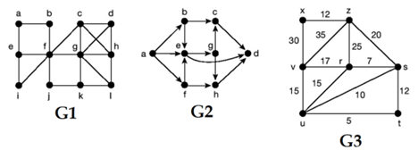

# Trabalho Prático B2 - Disciplina de Análise de Algoritmos

## Aluna: Barbara Diogo
## Código: 2063853

Este repositório contém implementações de algoritmos de grafos para o trabalho prático da disciplina de Análise de Algoritmos. Os algoritmos foram desenvolvidos em C++ e divididos em quatro exercícios, conforme descrito abaixo.

### Estrutura do Projeto

```
/
├── grafo.h                # Arquivo de cabeçalho compartilhado com definições e funções comuns
├── exercicio_01.cpp       # Implementação para leitura e impressão de grafos
├── exercicio_02.cpp       # Implementação de Busca em Largura (BFS)
├── exercicio_03.cpp       # Implementação de Busca em Profundidade (DFS)
├── exercicio_04.cpp       # Implementação do algoritmo de Dijkstra para caminho mínimo
├── grafos/                # Pasta contendo os arquivos de grafos de entrada
│   ├── g1.txt             # Arquivo de entrada para grafo não ponderado e não orientado
│   ├── g2.txt             # Arquivo de entrada para grafo orientado e não ponderado
│   ├── g3.txt             # Arquivo de entrada para grafo ponderado e não orientado
└── README.md              # Este arquivo
```

### Pré-requisitos

Para compilar e executar os programas, você precisará de um compilador C++ (como g++) e do CMake, caso queira automatizar o processo de compilação.

### Compilação e Execução

Cada exercício pode ser compilado e executado separadamente. Abaixo estão os comandos para compilar e executar cada um deles.

#### Exercicio 01

Leitura e impressão de grafos a partir de arquivos de texto.

```bash
g++ exercicio_01.cpp -o exercicio_01
./exercicio_01
```

#### Exercicio 02

Implementação da Busca em Largura (BFS) em um grafo não ponderado e não orientado (g1).

```bash
g++ exercicio_02.cpp -o exercicio_02
./exercicio_02
```

#### Exercicio 03

Implementação da Busca em Profundidade (DFS) em um grafo orientado e não ponderado (g2).

```bash
g++ exercicio_03.cpp -o exercicio_03
./exercicio_03
```

#### Exercicio 04

Implementação do algoritmo de Dijkstra para encontrar o caminho mínimo em um grafo ponderado e não orientado (g3).

```bash
g++ exercicio_04.cpp -o exercicio_04
./exercicio_04
```

### Descrição dos Exercícios



#### Exercicio 01

Este exercício lê três tipos diferentes de grafos a partir de arquivos de texto e imprime suas listas de adjacência.

- `g1.txt`: Grafo não ponderado e não orientado.
- `g2.txt`: Grafo orientado e não ponderado.
- `g3.txt`: Grafo ponderado e não orientado.

#### Exercicio 02

Este exercício implementa a Busca em Largura (BFS) partindo de um vértice específico em um grafo não ponderado e não orientado. O grafo é lido a partir do arquivo `g1.txt`.

#### Exercicio 03

Este exercício implementa a Busca em Profundidade (DFS) partindo de um vértice específico em um grafo orientado e não ponderado. O grafo é lido a partir do arquivo `g2.txt`.

#### Exercicio 04

Este exercício implementa o algoritmo de Dijkstra para encontrar o caminho mínimo entre dois vértices em um grafo ponderado e não orientado. O grafo é lido a partir do arquivo `g3.txt`.

### Estrutura dos Arquivos de Grafo

Cada arquivo de grafo contém linhas no seguinte formato:

- **g1.txt e g2.txt:** Cada linha representa uma aresta no formato `u;v`, onde `u` e `v` são os vértices.
- **g3.txt:** Cada linha representa uma aresta com peso no formato `u;v;w`, onde `u` e `v` são os vértices e `w` é o peso da aresta.

---

Este repositório faz parte das atividades acadêmicas da disciplina de Análise de Algoritmos e tem como objetivo a aplicação prática dos conceitos estudados sobre Grafos.